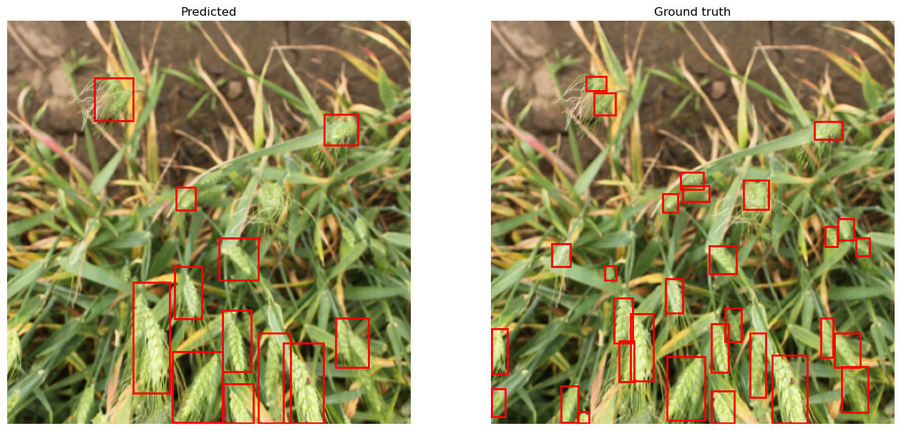
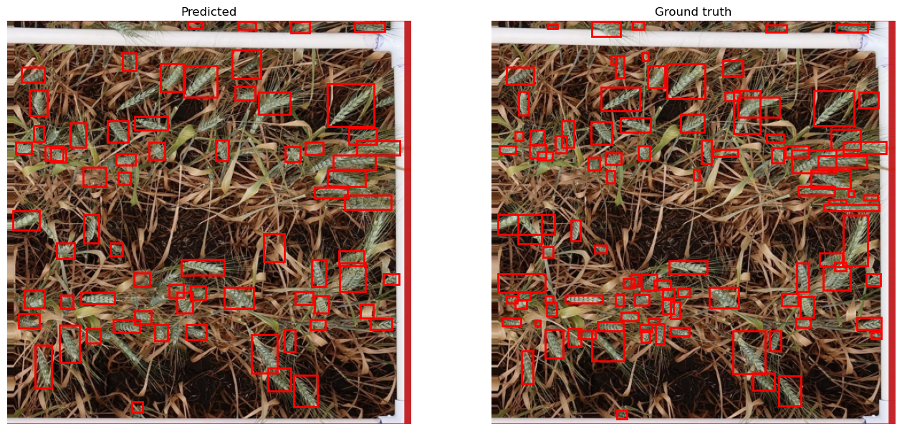

# Wheat-Detector

Final project for the _Advanced Computational Techniques for Big Imaging and Signal Data_ university course. This project is an implementation of a neural network for wheat head detection. The object detector is heavily inspired by the first iteration of [YOLO](https://arxiv.org/pdf/1506.02640.pdf), and the [Global Wheat Head](https://zenodo.org/records/5092309) dataset was used to train it and test it. Some examples of qualitative results are shown below, refer to the notebook for a more detailed description.

